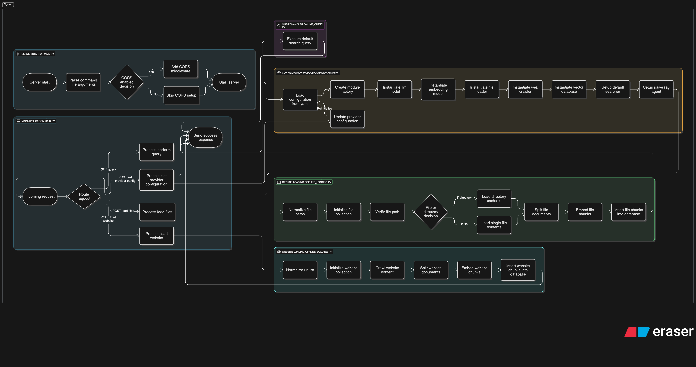

# DeepSearcher Workflow: Step-by-Step

This document provides a comprehensive overview of what happens when you run `python main.py`, add documents to the system, and query the knowledge base using DeepSearcher with OpenAI embeddings and FAISS vector database.

## Table of Contents
1. [Initialization Process](#initialization-process)
2. [Adding Documents to the System](#adding-documents-to-the-system)
3. [Querying the Knowledge Base](#querying-the-knowledge-base)
4. [Behind the Scenes: RAG Implementation](#behind-the-scenes-rag-implementation)
5. [Technical Implementation Details](#technical-implementation-details)

## Initialization Process

When you run `python main.py`, the following steps occur:

1. **Loading Configuration**:
   - The script initializes a `Configuration` object that reads settings from `deepsearcher/config.yaml`.
   - This configuration determines which components to use for:
     - LLM (OpenAI)
     - Embedding model (OpenAI Embedding)
     - Vector database (FAISS)
     - File loaders
     - Web crawlers

2. **Component Initialization**:
   - The `init_config()` function creates instances of all required components:
     ```python
     module_factory = ModuleFactory(config)
     llm = module_factory.create_llm()  # OpenAI model
     embedding_model = module_factory.create_embedding()  # OpenAI embeddings
     file_loader = module_factory.create_file_loader()
     web_crawler = module_factory.create_web_crawler()
     vector_db = module_factory.create_vector_db()  # FAISS database
     ```

3. **Starting the API Server**:
   - A FastAPI server starts on port 8000, exposing endpoints for:
     - Loading files (`/load-files/`)
     - Loading websites (`/load-website/`)
     - Querying the knowledge base (`/query/`)
     - Configuring providers (`/set-provider-config/`)

4. **Optional CORS Configuration**:
   - The server can be started with CORS enabled using the `--enable-cors` flag.

## Adding Documents to the System

When you add documents through the API or directly through the `load_from_local_files()` function, the following steps occur:

1. **Collection Setup**:
   - The system checks if the specified collection exists in the vector database.
   - If it doesn't exist or if `force_new_collection=True`, a new collection is created.
   - For FAISS, this means initializing a new index with the correct dimensions.

2. **Document Loading**:
   ```
   # Process flow
   Input documents → File loading → Document splitting → Embedding → Vector storage
   ```

3. **File Processing**:
   - **File Loading**: The appropriate loader reads the files based on their type (PDF, JSON, etc.).
   - If a directory is provided, all files in that directory are processed.

4. **Text Chunking**:
   - Documents are split into smaller chunks using `split_docs_to_chunks()`:
     ```python
     chunks = split_docs_to_chunks(
         all_docs,
         chunk_size=chunk_size,  # Default: 1500 characters
         chunk_overlap=chunk_overlap,  # Default: 100 characters
     )
     ```
   - Each chunk contains the text, its source reference, and metadata.

5. **Embedding Generation**:
   - The OpenAI embedding model converts each text chunk into a vector representation:
     ```python
     chunks = embedding_model.embed_chunks(chunks, batch_size=batch_size)  # Default batch_size: 256
     ```
   - This process sends requests to OpenAI's API to generate embeddings.

6. **Vector Storage**:
   - The embedded chunks are stored in the FAISS vector database:
     ```python
     vector_db.insert_data(collection=collection_name, chunks=chunks)
     ```
   - FAISS stores both the vectors and the original text/metadata for retrieval.

## Querying the Knowledge Base

When you send a query to the system, the following steps occur:

1. **Query Processing**:
   ```
   User query → DeepSearch/RAG → LLM response
   ```

2. **RAG Router**:
   - The query is passed to the RAG Router, which selects the appropriate RAG agent:
     ```python
     result_text, _, consume_token = query(original_query, max_iter)
     ```

3. **Information Retrieval**:
   - The system breaks down the query into sub-questions as needed.
   - For each sub-question, relevant document chunks are retrieved:
     ```python
     # DeepSearch agent workflow
     1. Create sub-queries from original query
     2. Retrieve documents for each sub-query
     3. Rerank and filter relevant documents
     4. Generate reflective follow-up queries if needed
     5. Repeat until sufficient context is gathered
     ```

4. **Response Generation**:
   - The LLM combines the retrieved information with the original query to generate a response.
   - The system tracks token usage throughout this process.

5. **Result Delivery**:
   - The API returns the response along with token usage information.

## Behind the Scenes: RAG Implementation

DeepSearcher utilizes a sophisticated RAG (Retrieval-Augmented Generation) system:

1. **RAG Router**:
   - Manages multiple RAG agents:
     - `DeepSearch`: Uses iterative retrieval with reflection
     - `ChainOfRAG`: Chains together multiple retrieval steps
     - `NaiveRAG`: Simple direct retrieval without iteration

2. **DeepSearch Agent**:
   - **Sub-query Generation**: Decomposes complex queries into smaller, focused questions.
   - **Iterative Retrieval**: Performs multiple rounds of retrieval to gather comprehensive information.
   - **Reflection**: Analyzes whether the retrieved information is sufficient and generates new queries as needed.

3. **Document Ranking**:
   - Retrieved documents are ranked based on relevance to the query.
   - A reranking step filters out less relevant documents.

## Technical Implementation Details

### FAISS Vector Database

The FAISS vector database handles the efficient storage and retrieval of document vectors:

1. **Index Creation**:
   ```python
   # In FAISSDB.init_collection()
   self.index = faiss.IndexFlatL2(dim)  # L2 distance metric for similarity search
   ```

2. **Document Storage**:
   - Vectors are stored in the FAISS index.
   - Original text, references, and metadata are stored separately but linked to vectors.

3. **Similarity Search**:
   - When a query is made, its embedding is compared to all stored vectors.
   - The most similar documents (by L2 distance) are returned.

### OpenAI Integration

1. **Embedding Generation**:
   - Uses OpenAI's embedding models (default: `text-embedding-ada-002`) to create vector representations.
   - The dimension of these vectors is typically 1536.

2. **LLM Integration**:
   - Uses OpenAI's language models (default: `o1-mini`) for:
     - Generating sub-queries
     - Reasoning about document relevance
     - Producing final responses

3. **API Communication**:
   - The system manages API rate limits and handles potential API errors.
   - Token usage is tracked for cost monitoring.

---

This workflow document provides a comprehensive overview of the DeepSearcher system, focusing specifically on the implementation using OpenAI embeddings and the FAISS vector database. The system's modular architecture allows for easy extension and customization while maintaining high performance for document retrieval and question answering tasks.



