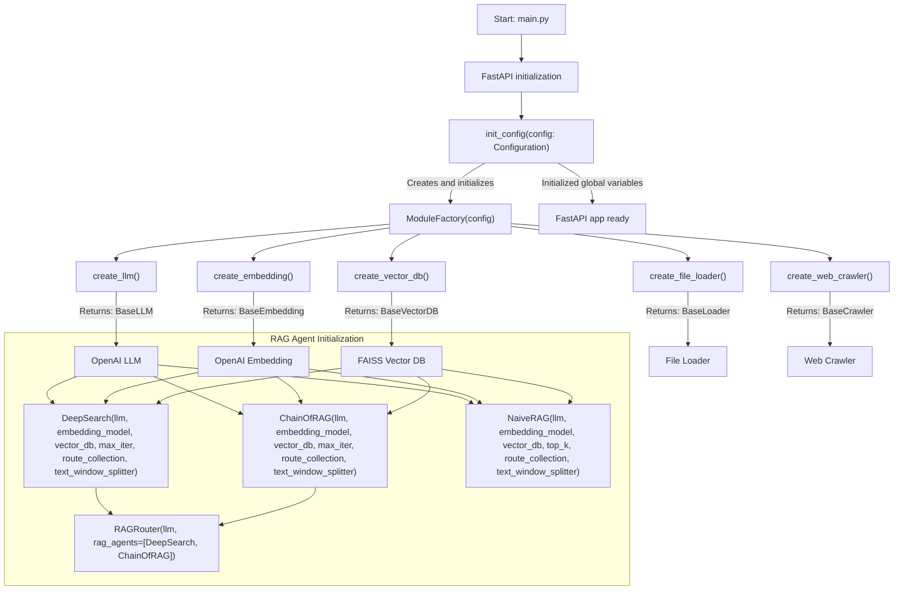
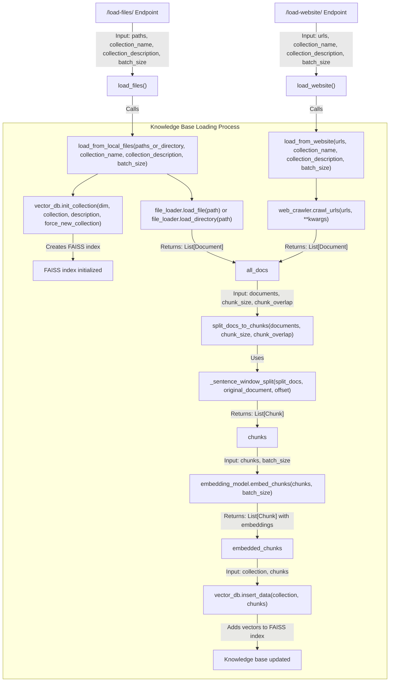
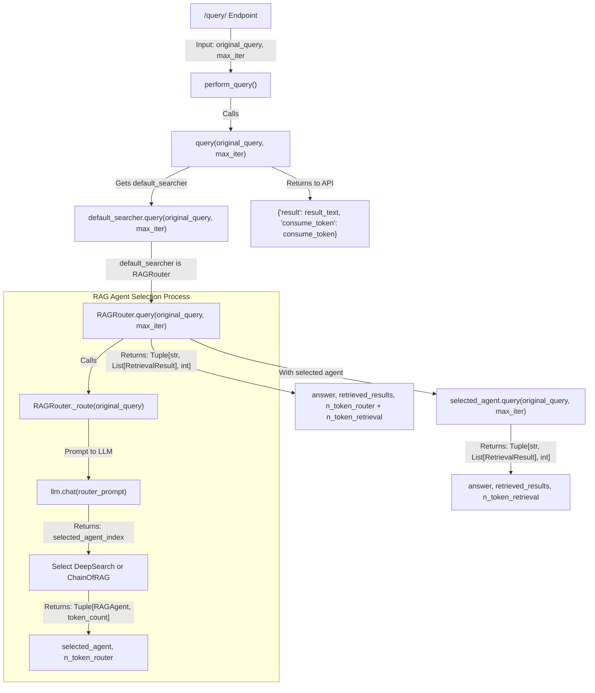
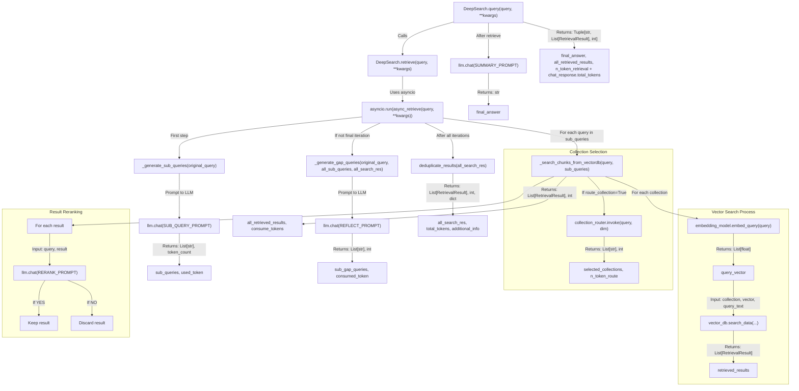
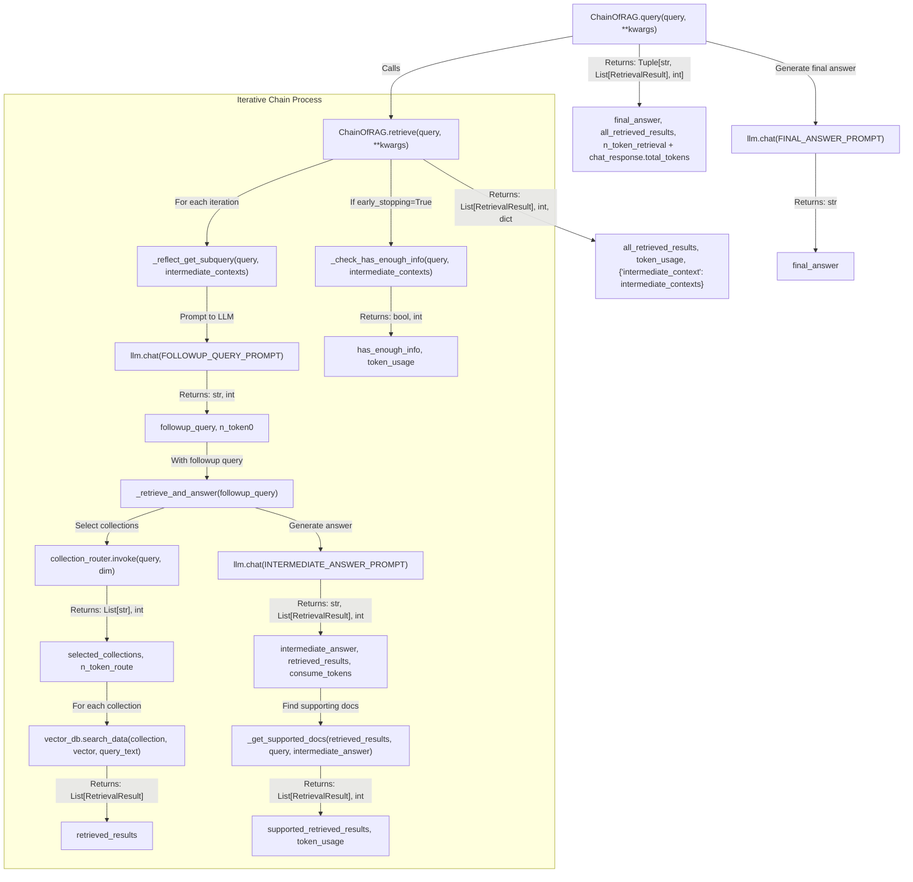
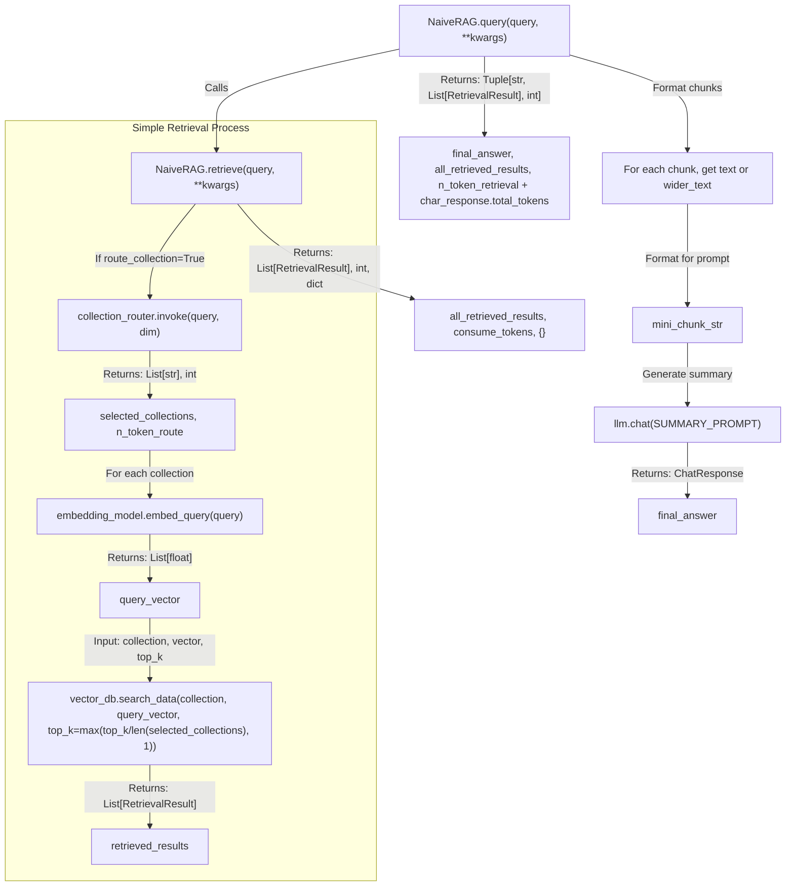
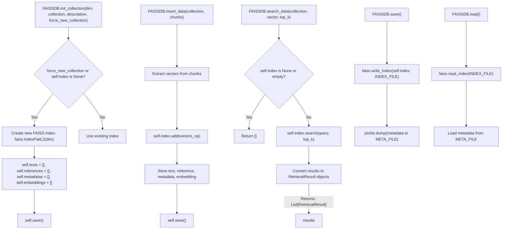
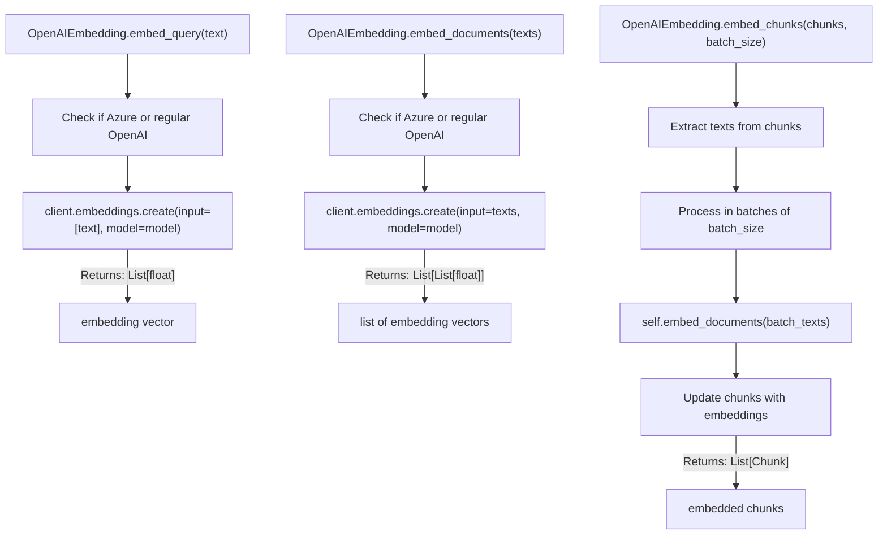
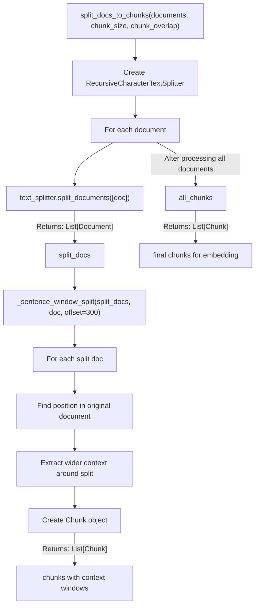
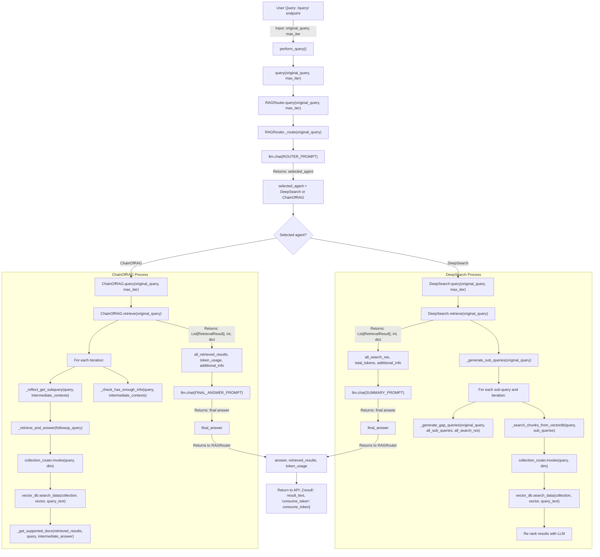

# DeepSearcher Flowchart: From `main.py` to RAG Query Resolution

## 1. Application Entry and Initialization Flow

## 2. Document Loading Flow

## 3. Query Execution Flow

## 4. DeepSearch Agent Workflow

## 5. ChainOfRAG Agent Workflow

## 6. NaiveRAG Agent Workflow

## 7. FAISS Vector Database Operations

## 8. OpenAI Embedding Operations

## 9. Document Splitting Operations

## Complete End-to-End Query Flow: From User Request to Response

## Legend and Function Details

### Key Components

1. **FastAPI**: Web framework that handles HTTP requests
2. **Configuration**: Manages settings and component initialization
3. **ModuleFactory**: Creates instances of LLMs, embeddings, etc.
4. **RAGRouter**: Routes queries to appropriate RAG agents
5. **DeepSearch**: Complex RAG agent for comprehensive information retrieval
6. **ChainOfRAG**: RAG agent that decomposes queries into iterative steps
7. **NaiveRAG**: Simple RAG agent for basic retrieval operations
8. **FAISSDB**: Vector database for storing and searching embeddings
9. **OpenAIEmbedding**: Generates embeddings using OpenAI's API

### Key Function Inputs/Outputs

| Function | Inputs | Outputs | Description |
|---------|--------|---------|-------------|
| `init_config()` | `config: Configuration` | None (sets globals) | Initializes all system components |
| `load_from_local_files()` | `paths_or_directory, collection_name, collection_description, batch_size` | None | Loads documents from files into vector DB |
| `load_from_website()` | `urls, collection_name, collection_description, batch_size` | None | Loads documents from websites into vector DB |
| `query()` | `original_query: str, max_iter: int` | `Tuple[str, List[RetrievalResult], int]` | Main query function that routes to RAG agents |
| `RAGRouter._route()` | `query: str` | `Tuple[RAGAgent, int]` | Selects best RAG agent for query |
| `DeepSearch.retrieve()` | `original_query: str, **kwargs` | `Tuple[List[RetrievalResult], int, dict]` | Retrieves documents using sub-queries and reflection |
| `ChainOfRAG.retrieve()` | `query: str, **kwargs` | `Tuple[List[RetrievalResult], int, dict]` | Retrieves documents using iterative queries |
| `split_docs_to_chunks()` | `documents: List[Document], chunk_size: int, chunk_overlap: int` | `List[Chunk]` | Splits documents into smaller chunks |
| `embed_chunks()` | `chunks: List[Chunk], batch_size: int` | `List[Chunk]` | Adds embeddings to document chunks |
| `vector_db.search_data()` | `collection: str, vector: List[float], top_k: int` | `List[RetrievalResult]` | Searches for similar vectors in database |
